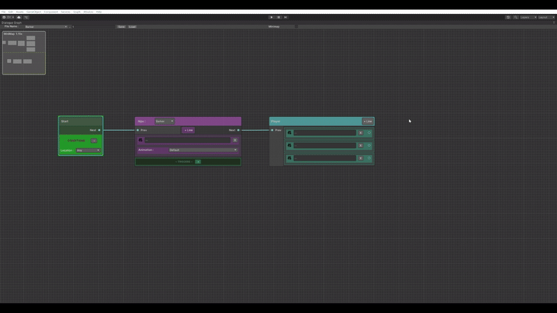

# Unity Dialogue Graph Editor

A fully custom dialogue graph editor built using Unity's UIElements and GraphView framework.

This tool enables developers and narrative designers to create branching dialogue structures with conditional logic in a visual, node-based interface. It supports runtime serialization, recovery saves, and integration with gameplay logic through triggers and conditions.

## Features

- Visual node-based editor for:
  - NPC lines
  - Player choices
  - Start nodes
- Inline editing of dialogue content and branching logic
- Dialogue conditions and trigger actions per line
- Runtime serialization via ScriptableObjects
- JSON-convertible dialogue container for runtime use
- Recovery system for unsaved work
- Save/load system using Unity Resources
- Fully customizable with extensible enums (e.g., NpcName, ItemName, Location)
- No external packages or dependencies

## System Overview

## How to Use

### 1. Open the Editor

Go to: Graph > Dialogue Graph

This opens the dialogue graph editor window.

Use the `NpcName` enum dropdown in the toolbar to select or bind the dialogue to an NPC. Add a short extension (e.g., `Intro`, `Scene1`) using the adjacent input field to name the dialogue file. The final file will be saved under: Resources/Dialogues/NpcName/NpcName_Extension.asset

---

### 2. Create Nodes

Hit space anywhere in the graph view to add nodes:

- **Start Node** – Marks the entry point of the dialogue.
- **NPC Line Node** – For lines spoken by NPCs.
- **Player Line Node** – For player response options.

Connect nodes to define the branching structure of the conversation.

Each line node can contain:

- Multiple dialogue entries
- Conditional logic (e.g., item possession, location checks)
- Trigger actions (e.g., set a flag, unlock a new node)

---

### 3. Use Conditions and Triggers

Each line can have:

- **Conditions** (e.g., inventory checks, location status)
- **Triggers** (e.g., unlocks, flag updates)

---

### 4. Save and Load

- Use the **Save** button in the toolbar to serialize the graph as a `.asset` file.
- Use the **Load** button to reopen previously saved dialogues.
- The system auto-saves to a temporary file on exit (`Dialogues/Recovery.asset`) for crash recovery.

---

## Architecture Highlights

- Dialogue data is stored as `DialogueContainer` ScriptableObjects.
- All logic—conditions, triggers, node types—is built to be data-driven and extensible.
- Dialogue files can be loaded at runtime and converted to or from JSON.
- Everything is organized for designer-friendly editing with programmer-level control over execution.

---

## Extending the System

You can add custom logic by editing or expanding:

- `NpcName`, `ItemName`, `Location` enums
- `DialogueCondition` and `DialogueAction` types
- Dialogue node behavior, visual elements, or runtime serializers

No external libraries are used. All logic is written natively in Unity with full editor scripting control.

---

# Folder Structure Overview

### `DialogueManagement/`
Main root folder containing all editor, runtime, and utility logic for the custom dialogue graph.

---

### `Editor/`

Contains all custom editor tools using Unity’s `GraphView` and `UIElements` systems.

- **`DialogueGraph.cs`**  
  Main `EditorWindow` that opens the Dialogue Graph UI.

- **`DialogueGraphView.cs`**  
  Core `GraphView` container where all dialogue nodes are displayed and connected.

- **`DialogueNode` classes**  
  Custom visual node classes for NPC lines, Player lines, and Start nodes.

---

### `Runtime/`

Contains all runtime-serializable data used by the dialogue system in-game.

- **`DialogueContainer.cs`**  
  ScriptableObject container that holds all dialogue nodes and handles lookups at runtime.

- **`DialogueNodeData.cs`**  
  Base class and subclasses for serialized node data: `NpcNodeData`, `PlayerNodeData`, `StartNodeData`.

- **`DialogueCondition.cs`**  
  Represents conditional logic that controls node availability based on game state (e.g., item held, location).

- **`DialogueAction.cs`**  
  Defines actions triggered during dialogue (e.g., setting flags, unlocking new dialogue).

---

### Utility Scripts

- **`GraphSaveUtility.cs`**  
  Handles saving and loading dialogue graphs to Unity `Resources` using ScriptableObjects.

- **`DialogueJsonHandler.cs`**  
  Optional runtime support for converting `DialogueContainer` objects to and from JSON files.
---

## License

This project is open-source and free to use in commercial or personal projects.  <3

